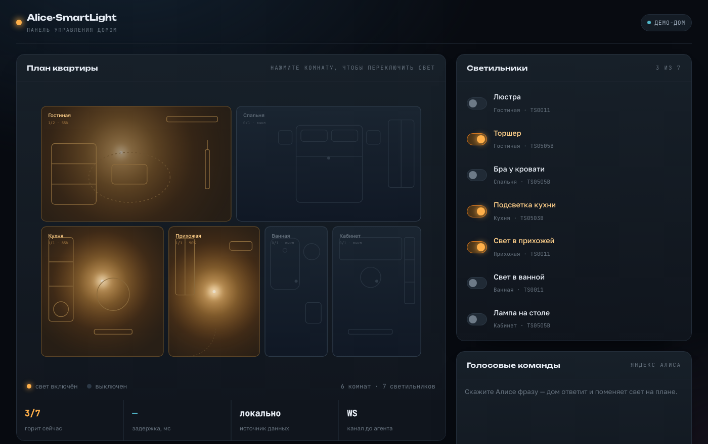
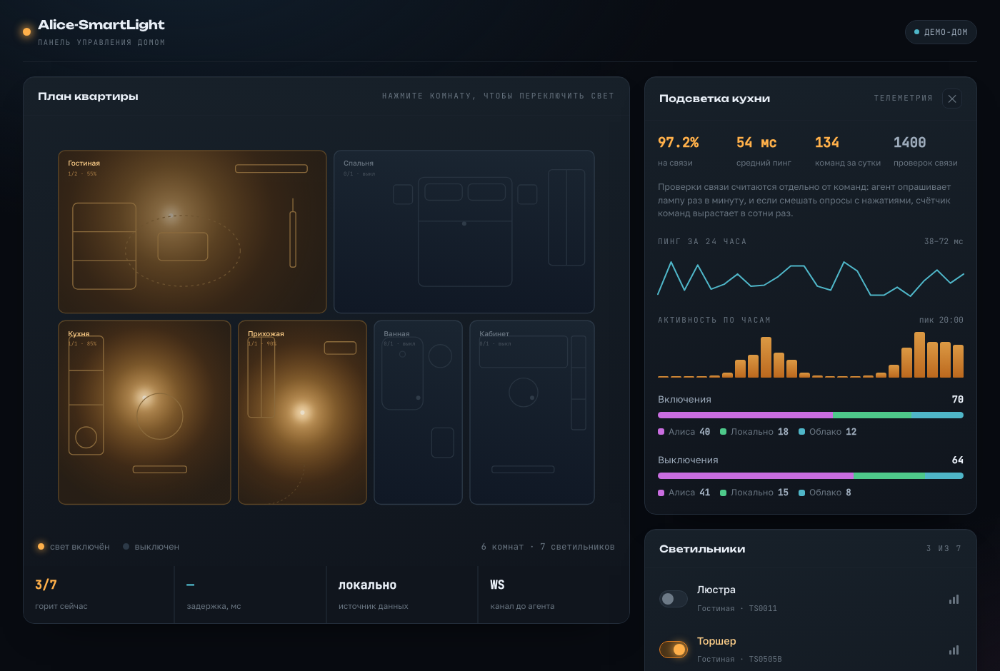

# Alice-SmartLight — облачный backend умного дома

> **EN (summary).** Cloud half of the **Alice-SmartLight** smart-home system — a real, deployed project.
> A FastAPI service that connects **Yandex Alice** (Smart Home API + OAuth) to a **home agent** running on the
> user's local network over a persistent **WebSocket tunnel**. The cloud never talks to lamps directly: it holds
> a cached device state, answers Alice **optimistically in under ~1.5 s** (inside Alice's request timeout), and
> forwards the real command to the home agent in the background. JWT auth, per-IP rate limiting, security
> middleware and scheduled maintenance jobs included.

---

Облачная половина умного дома **Alice-SmartLight** (реальный проект в проде). Сервис на **FastAPI**, который
соединяет **Яндекс Алису** с домашним агентом пользователя и позволяет управлять устройствами голосом.

Ключевая инженерная задача — уложиться в жёсткий таймаут запроса от Алисы, при том что реальное устройство
находится за домашним роутером (NAT, серый IP) и может отвечать медленно. Решение — **оптимистичные ответы**
поверх постоянного **WebSocket-туннеля** «облако ↔ локальный агент».

## Панель управления домом

**Живое демо: https://olegg000.github.io/alice-301-backend/** — открывается без установки и без сервера.



Веб-панель показывает дом так, как его видит хозяин: план квартиры, где комнаты наливаются тёплым светом
по состоянию светильников. Нажатие на комнату переключает в ней свет, карточки справа управляют каждым
устройством по отдельности, а лента голосовых команд проигрывает диалог с Алисой и меняет состояние дома
на глазах.

### Телеметрия устройства



Кнопка с диаграммой в строке светильника раскрывает его телеметрию — те же метрики,
что собирает десктопная панель агента: время на связи, средний пинг и его история за
сутки, активность по часам и разбивка команд по источнику — **Алиса / локально /
облако**, отдельно на включение и выключение. Ссылка вида `?device=kt-strip`
открывает телеметрию нужного устройства сразу.

Служебные проверки связи вынесены в отдельный счётчик и не смешиваются с командами:
агент опрашивает лампу раз в минуту, поэтому за сутки набегает около полутора тысяч
опросов против десятков реальных нажатий — если сложить их в одно число, метрика
перестаёт что-либо значить.

Панель работает в двух режимах:

| Режим | Что делает |
|---|---|
| **Демо-дом** (по умолчанию) | Состояние живёт в памяти вкладки: шесть комнат, семь светильников. Бекенд не нужен. |
| **Свой сервер** | Кнопка в шапке открывает форму адреса и токена. Панель ходит в те же эндпоинты, что и Яндекс Алиса: `/v1.0/user/devices`, `query`, `action`. |

Запуск локально:

```bash
cd web
npm install
npm run dev
```

Сборка для GitHub Pages выполняется автоматически при пуше в `main`
(`.github/workflows/pages.yml`, переменная `BASE_PATH`).

Стек панели: **React 19 + TypeScript + Vite**, интерфейс собран без UI-библиотек — план квартиры и свет
нарисованы SVG-градиентами, чтобы страница оставалась лёгкой (66 КБ gzip).

## Как это устроено

```
   Голос                Smart Home API            WebSocket-туннель
 ┌────────┐   OAuth   ┌──────────────────┐   постоянное соединение   ┌──────────────┐
 │ Алиса  │──────────▶│  Alice-SmartLight │◀─────────────────────────▶│ Домашний     │
 │ / апп  │  Bearer   │  cloud (FastAPI)  │   ws/agent/{jwt}          │ агент (LAN)  │
 └────────┘◀──────────│                   │──────────────────────────▶└──────┬───────┘
   ответ < ~1.5с      │  кэш состояния,   │   команды в фоне                 │
                      │  JWT, rate-limit  │                                  ▼
                      └──────────────────┘                            реальные устройства
```

1. **OAuth Яндекса.** Пользователь привязывает аккаунт: `/auth` отдаёт форму входа, `/auth/callback` выдаёт
   authorization code, `/auth/token` меняет его на долгоживущий Bearer-токен для Smart Home API.
2. **WebSocket-туннель.** Домашний агент держит постоянное соединение `ws/agent/{jwt}`. Через него облако
   отправляет команды и запрашивает статусы, а агент рапортует об изменениях. Так решается проблема серого IP:
   входящее соединение инициирует именно агент.
3. **Оптимистичные ответы.** На `POST /v1.0/user/devices/action` облако сразу пишет новое состояние в кэш и
   отвечает Алисе `DONE`, **не дожидаясь** дома. Реальная команда уходит агенту фоновой задачей
   (`asyncio.create_task`). За счёт этого ответ укладывается в таймаут Алисы (~1.5 с), даже если дом отвечает
   секунды. На `.../query` тем же приёмом отдаётся кэшированный статус, а фоновое обновление подтягивает
   свежие данные к следующему запросу (см. проверку свежести кэша в `yandex_api.py`).

## Стек

- **FastAPI** + Uvicorn — HTTP и WebSocket
- **JWT** (python-jose) — авторизация агента и пользователей, access/refresh токены
- **TinyDB** — лёгкое JSON-хранилище пользователей, токенов, сессий
- **APScheduler** — фоновые задачи (бэкапы БД, очистка кодов/сессий, health-check соединений)
- Собственные **middleware**: security-заголовки, rate limiting по IP, сбор метрик, логирование запросов
- **Docker** / docker-compose для деплоя

## Быстрый старт

```bash
docker compose up --build
```

Больше ничего не нужно: `.env` не обязателен, `SECRET_KEY` генерируется на старте,
данные ложатся в `./db`.

- Swagger UI — `http://localhost:8000/docs`
- Проверка живости — `http://localhost:8000/health`
- OAuth-форма Яндекса — `http://localhost:8000/auth?client_id=demo&redirect_uri=http://localhost/cb&response_type=code&state=xyz`

Если порт 8000 занят — `HOST_PORT=8001 docker compose up --build`.

Боевой запуск отличается двумя вещами: `ENVIRONMENT=production` (скрывает `/docs`)
и собственный `SECRET_KEY` вместе с реквизитами Яндекса в `.env` — образец в
`.env.example`.

### Без Docker

```bash
python -m venv .venv && source .venv/bin/activate
pip install -r requirements.txt
ENVIRONMENT=development uvicorn main:app --port 8000
```

## Проверить руками

```bash
# завести пользователя
curl -X POST http://localhost:8000/register \
  -H 'Content-Type: application/json' \
  -d '{"username":"demo","password":"DemoPass123!"}'

# пройти OAuth так, как это делает Яндекс: логин формой -> authorization code
curl -i -X POST http://localhost:8000/auth/callback \
  -d 'client_id=demo' -d 'redirect_uri=http://localhost/cb' -d 'state=xyz' \
  -d 'username=demo' -d 'password=DemoPass123!'
# 307 Location: http://localhost/cb?code=<CODE>&state=xyz

# обменять код на Bearer для Smart Home API
curl -X POST http://localhost:8000/auth/token -d 'code=<CODE>'
```

## Структура

| Файл                    | Назначение                                                             |
|-------------------------|------------------------------------------------------------------------|
| `main.py`               | Точка входа FastAPI: эндпоинты auth, OAuth, Smart Home API, WebSocket   |
| `yandex_api.py`         | Обработчик Smart Home API Яндекса (devices/query/action, оптимистично)  |
| `websocket_manager.py`  | Менеджер WS-соединений с агентами: ping/pong, запрос статусов, команды  |
| `auth.py`               | JWT, хеширование паролей, валидация, rate limiter, зависимости FastAPI  |
| `db_manager.py`         | Доступ к TinyDB: пользователи, токены Яндекса, коды авторизации, сессии |
| `middleware.py`         | CORS, security-заголовки, rate limit по IP, метрики, логирование        |
| `scheduler.py`          | Фоновые задачи: бэкапы, очистка, health-check, сбор статистики          |
| `web/`                  | Панель управления домом: React 19 + TypeScript + Vite, план квартиры в SVG |
| `config.py`             | Настройки через pydantic-settings (читаются из `.env`)                  |

## Эндпоинты

Полная интерактивная версия — в Swagger UI на `/docs`.

| Раздел | Метод | Путь | Что делает |
| --- | --- | --- | --- |
| Сервис | `GET` | `/` | Имя, версия, окружение |
| Сервис | `GET` | `/health` | Состояние БД, WebSocket и планировщика |
| Аккаунт | `POST` | `/register` | Регистрация, сразу отдаёт пару токенов |
| Аккаунт | `POST` | `/token` | Вход по логину и паролю (OAuth2 password form) |
| Аккаунт | `POST` | `/refresh` | Обновление access-токена по refresh |
| Аккаунт | `POST` | `/change-password` | Смена пароля |
| Аккаунт | `POST` | `/logout` | Завершение сессии |
| Аккаунт | `GET` | `/me` | Профиль текущего пользователя |
| Аккаунт | `GET` | `/me/sessions` | Активные сессии |
| OAuth Яндекса | `GET` | `/auth` | Форма привязки аккаунта |
| OAuth Яндекса | `POST` | `/auth/callback` | Выдаёт authorization code и редиректит |
| OAuth Яндекса | `POST` | `/auth/token` | Меняет код на Bearer для Smart Home API |
| Smart Home | `HEAD` | `/v1.0/` | Проба доступности, которую делает Яндекс |
| Smart Home | `POST` | `/v1.0/user/unlink` | Отвязка аккаунта |
| Smart Home | `GET` | `/v1.0/user/devices` | Список устройств пользователя |
| Smart Home | `POST` | `/v1.0/user/devices/query` | Состояния устройств из кэша |
| Smart Home | `POST` | `/v1.0/user/devices/action` | Команда с оптимистичным ответом |
| Агент | `POST` | `/api/v1/user/devices` | Агент публикует свой список устройств |
| Агент | `WS` | `/ws/agent/{token}` | Постоянный туннель «облако ↔ дом» |
| Админ | `GET` | `/admin/stats` | Метрики сервиса и фоновых задач |
| Админ | `GET` | `/admin/audit` | Журнал аудита |
| Админ | `POST` | `/admin/tasks/{task_id}/run` | Ручной запуск фоновой задачи |
| Админ | `POST` | `/admin/backup` | Резервная копия БД |

---

---

Студия Лендвис · [landvis.ru](https://landvis.ru)
